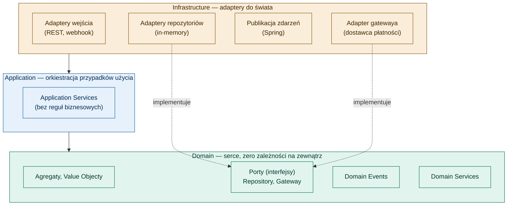
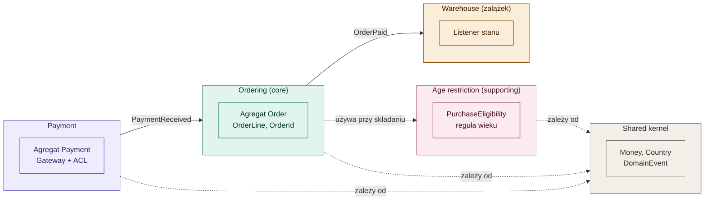
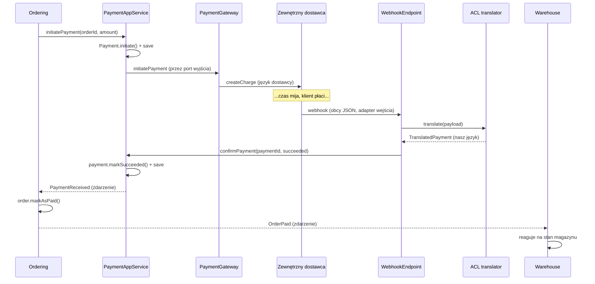
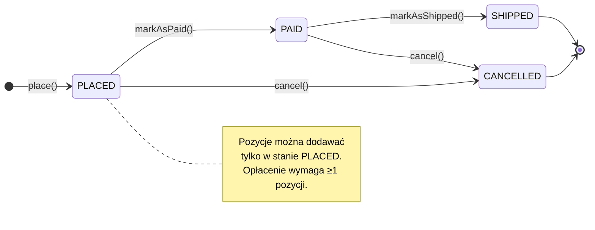

# DDD Shop — projekt edukacyjny

Sklep internetowy budowany krok po kroku jako praktyczne wprowadzenie do **Domain-Driven Design** w Javie i Spring Boot. Projekt powstał w ramach 12-tygodniowego kursu i służy jako żywa architektura referencyjna: każdy wzorzec DDD jest tu zaimplementowany, przetestowany i osadzony w realnym przepływie.

## Stack

- **Java 25** (przez Gradle toolchain)
- **Gradle 9** (wrapper w repo)
- **Spring Boot 4.0**
- H2 in-memory (zero zewnętrznej konfiguracji)
- Repozytoria zaimplementowane in-memory (świadoma decyzja dydaktyczna — patrz niżej)

## Uruchomienie

```bash
./gradlew bootRun     # start aplikacji na http://localhost:8080
./gradlew test        # uruchomienie wszystkich testów
```

Pierwsze uruchomienie pobierze Gradle 9 oraz JDK 25 (toolchain), jeśli ich nie masz. Do odpalenia samego Gradle wystarczy dowolne JDK w wersji 17–26.

---

## Zakres kursu

Projekt przechodzi przez pełną drogę od pytania "po co DDD" do działającego, wielokontekstowego systemu.

| Tydzień | Temat | Co powstało |
|---------|-------|-------------|
| 1–2 | Fundamenty i język | Ubiquitous Language, subdomeny, szkielet projektu |
| 3–4 | Building blocks | Value Objecty (`Money`, `Country`, `Address`, `ProductId`, `Quantity`), encja `Order` |
| 5–6 | Agregaty | `Order` jako Aggregate Root: granica spójności, referencje przez ID, invarianty |
| 7 | Repositories i Domain Services | Repozytorium jako port, `PurchaseEligibility` (reguła wieku) |
| 8 | Domain Events | `OrderPlaced`, `OrderPaid`, zbieranie zdarzeń w agregacie |
| 9–10 | Architektura wokół domeny | Heksagon, Application Services, publikacja zdarzeń |
| 11 | Bounded Contexts | Context Map, wzorce relacji (Shared Kernel, Customer-Supplier, ACL) |
| 12 | Synteza i pomost dalej | Najczęstsze błędy, kiedy NIE używać DDD, pomosty do CQRS/ES/mikroserwisów |
| (rozszerzenie) | Payment + Gateway + ACL | Pełny kontekst płatności z Anticorruption Layer |

---

## Architektura: warstwy i kierunek zależności

Projekt jest zbudowany heksagonalnie (Ports & Adapters). Domena jest w centrum i nie wie o niczym na zewnątrz; zależności pokazują **do środka**.



**Żelazna zasada:** `infrastructure → application → domain`, nigdy odwrotnie. Domena nie zawiera ani jednej adnotacji frameworka. Cała technologia (Spring, baza, dostawca płatności) jest zamknięta w adapterach na brzegach.

### Dlaczego repozytoria są oddzielone od JPA

Domena (`Order`, `Payment`) jest całkowicie czysta — bez `@Entity`, `@Id`, konstruktorów bezargumentowych czy setterów. Repozytoria to porty w domenie, a ich implementacje (adaptery) trzymają osobny "model persystencji". Ta jedna decyzja chroni invarianty agregatów, poprawność zdarzeń (odtwarzanie z magazynu nie generuje zdarzeń) i czystość heksagonu — a także otwiera naturalną drogę do Event Sourcingu.

---

## Bounded Contexts — mapa systemu

System dzieli się na cztery konteksty plus wspólne jądro. Każdy kontekst ma własny model i własny język; konteksty komunikują się **zdarzeniami domenowymi** (luźne powiązanie) albo wywołaniem usługi.



### Wzorce relacji między kontekstami

- **Domain Events / Published Language** (`ordering → warehouse`, `payment → ordering`) — kontekst ogłasza fakt, zainteresowani nasłuchują. Nadawca nie wie, kto słucha. Najzdrowszy, najluźniejszy typ relacji.
- **Shared Kernel** (`shared`) — mały, świadomie współdzielony fragment modelu (`Money`, `Country`). Wygodny, ale tworzy sprzężenie — dlatego trzymany malutki.
- **Customer-Supplier** (`ordering → agerestriction`) — ordering konsumuje usługę sprawdzenia wieku.
- **Anticorruption Layer** (`payment`) — warstwa tłumacząca obcy model zewnętrznego dostawcy płatności na nasz czysty język. Patrz przepływ niżej.

---

## Przepływ płatności (Gateway + ACL)

Najbardziej kompletny przepływ w projekcie — spina wszystkie wzorce. Pokazuje dwa kierunki integracji z zewnętrznym dostawcą oraz rolę Anticorruption Layer.



**Kluczowa właściwość:** ani `ordering`, ani `warehouse` nie wiedzą, że istnieje jakikolwiek dostawca płatności. Słowo "charge" nie przedostaje się poza ACL. Wymiana dostawcy (np. na PayU) to przepisanie jednego pliku — `ProviderWebhookTranslator` — reszta systemu nie drga.

### Dwa kierunki integracji

- **Wychodzący** (my → dostawca): port `PaymentGateway` + adapter. Domena mówi "zainicjuj płatność", nie wiedząc jak.
- **Przychodzący** (dostawca → my): adapter wejścia (webhook) + ACL tłumaczący obcy payload na nasze pojęcia, zanim cokolwiek wejdzie do domeny.

---

## Cykl życia agregatów

Agregaty bronią swoich invariantów przez kontrolowane przejścia stanu. Stan zmienia się tylko przez metody o nazwach z języka biznesu — nigdy przez settery.



Analogicznie agregat `Payment`: `INITIATED → SUCCEEDED` (emituje `PaymentReceived`) lub `INITIATED → FAILED`.

---

## Struktura projektu

```
com.example.shop
├── ordering/              CORE — silnik zamówień
│   ├── domain/                Order (Aggregate Root), OrderLine, OrderId,
│   │                          Quantity, OrderStatus, OrderRepository (port),
│   │                          OrderPlaced, OrderPaid (zdarzenia)
│   ├── application/           OrderApplicationService, PlaceOrderCommand,
│   │                          MarkOrderPaidOnPaymentReceived (listener)
│   └── infrastructure/        InMemoryOrderRepository, SpringDomainEventPublisher
│
├── payment/               Kontekst płatności z Gateway + ACL
│   ├── domain/                Payment (Aggregate Root), PaymentId, PaymentStatus,
│   │                          PaymentRepository (port), PaymentGateway (port),
│   │                          PaymentReceived (zdarzenie)
│   ├── application/           PaymentApplicationService
│   └── infrastructure/        FakeProviderApi, FakePaymentGateway,
│                              ProviderWebhookTranslator (ACL),
│                              ProviderWebhookEndpoint (adapter wejścia),
│                              InMemoryPaymentRepository
│
├── agerestriction/        SUPPORTING — reguła ograniczenia wiekowego
│   └── domain/                AgeRestriction, PurchaseEligibility (Domain Service)
│
├── warehouse/             Zalążek kontekstu magazynu
│                              StockOnOrderPaid (listener OrderPaid)
│
└── shared/                Shared Kernel
                               Money, Country, Address,
                               DomainEvent, DomainEventPublisher (port)
```

---

## Kluczowe decyzje projektowe (dziennik)

Decyzje podjęte w trakcie kursu, warte zapamiętania:

- **Ograniczenie wiekowe zależy od pary (jurysdykcja, rodzaj produktu)**, nie od jednej "pełnoletności". Jurysdykcję wyznacza **kraj dostawy** (tam następuje wydanie towaru), nie obywatelstwo ani IP. Zweryfikowane: PL i UK gateują zakup alkoholu na 18 lat (popularne "UK = 21" to błąd — to liczba z USA).
- **`OrderLine` trzyma `ProductId` (referencja przez ID) + snapshot ceny i nazwy**, nie cały obiekt `Product`. Chroni zamówienie przed zmianami w katalogu: "cena zakupu" to inne pojęcie niż "cena katalogowa".
- **Agregaty są małe.** `Customer`, `Product`, `StockItem`, `Payment` to osobne agregaty/konteksty, połączone referencją przez ID i spójnością ostateczną przez zdarzenia. Jedna transakcja zmienia jeden agregat.
- **Płatność to osobny kontekst, nie część `ordering`** — ma własny cykl życia i własny język, a obcego dostawcę izoluje ACL.
- **Value Objecty są niezmienne i bronią swoich invariantów** (np. `Money` nie pozwala mieszać walut — to błąd w domenie, nie cicha konwersja).

---

## Kiedy używać tego podejścia

DDD to inwestycja, nie cnota. Opłaca się tam, gdzie złożoność leży w **regułach biznesowych** (zamawianie, wycena, płatności, rezerwacje). Dla prostego CRUD (np. panel z listą pracowników, gdzie jedyna reguła to "unikalny e-mail") pełne taktyczne DDD to czysty narzut — wtedy lepsza jest najprostsza encja JPA + Spring Data. Decyzja jest **per kontekst**: core dostaje DDD, proste fragmenty generic/supporting robi się lekko.

---

## Pomosty do dalszych tematów

Projekt jest fundamentem pod kolejne kroki:

- **CQRS** — rozdzielenie strony zapisu (agregat, twarda spójność) od strony odczytu (widok składany z wielu źródeł). Projekt już rozróżnia te światy.
- **Event Sourcing** — `pullDomainEvents()` + `reconstitute()` to zalążek maszynerii: wystarczy zamienić "zapisz stan" na "zapisz i odtwarzaj zdarzenia".
- **Mikroserwisy** — każdy bounded context to kandydat na serwis. Komunikacja zdarzeniami przejdzie z `ApplicationEventPublisher` na broker (Kafka/RabbitMQ), a model się nie zmieni, bo publikacja jest schowana za portem. (Uwaga: modular monolith z kontekstami w pakietach często jest lepszym celem niż rozbicie na serwisy.)

---

## Testy

```bash
./gradlew test
```

41 testów: od jednostkowych testów Value Objectów i agregatów (bez zależności, błyskawiczne) po pełny test integracyjny przepływu płatności przez kontekst Spring (`PaymentFlowIntegrationTest`), który przechodzi przez cztery konteksty i trzy łańcuchy zdarzeń.

---

## Książki-kotwice

- Vaughn Vernon — *Implementing Domain-Driven Design* (najlepsza praktycznie, z kodem)
- Vaughn Vernon — *Domain-Driven Design Distilled* (zwięzłe wprowadzenie)
- Eric Evans — *Domain-Driven Design* (oryginał, koncepcyjny — czytać wybiórczo)
